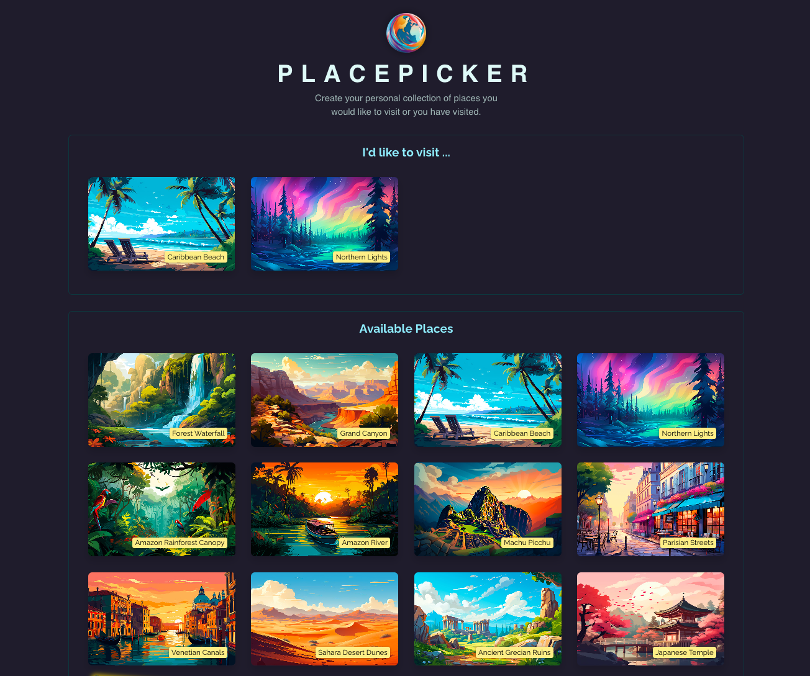

# App Overview

This Place Picker app was created for pacticing React concepts, especially the useEffect Hook.
The app allows user to pick a place they want to visit. The picked places will be moved to the wish list. Initially, the app is asking for user to allow user's location access permission so that the app will sort the places by the closest distance to the user's current location. User can remove any picked places.

- Live URL (Hosted with Firebase): https://tic-tac-toe-reactjs-7a95f.web.app/

## User Story

A tourist wants to find nearest places to put in their wish list for visiting.

## Techniques applied

- Using useEffect hook for handling side effects
- Using useEffect hook for syncing with browser APIs
- Usiung useEffect's cleanup function
- Solving problems with Objects & Function Dependencies of useEffect hook
- Using useCallback hook for safely avoiding infinite loop while using useEffect

## Technologies Used

- React
- JavaScript
- HTML 5
- CSS

Note: I coded along while following React course by Academind @ https://github.com/academind
